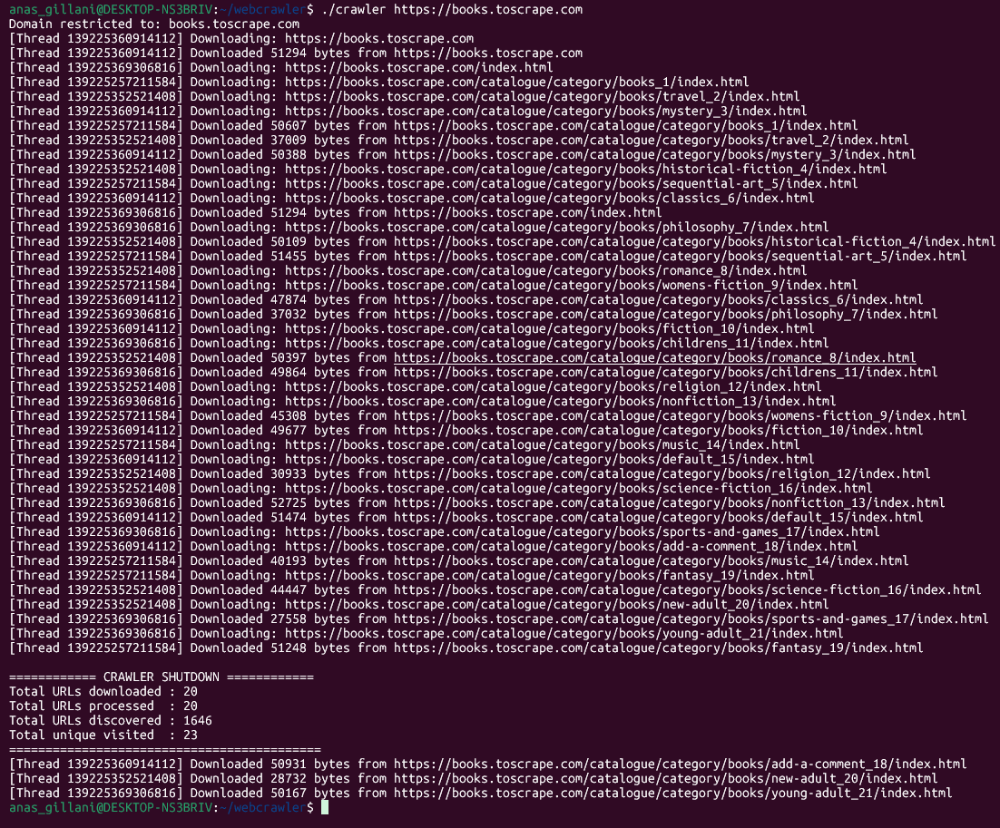
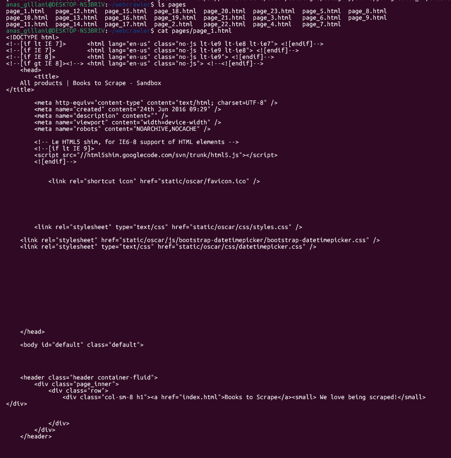

# Multithreaded Web Crawler (C++)

This project is a multithreaded web crawler implemented in C++ using POSIX threads
and libcurl. It demonstrates core Operating System concepts such as multithreading,
synchronization, and the producer–consumer problem.

---

## Features
- Multithreaded crawling using pthreads
- Thread-safe URL queue (producer–consumer model)
- Domain restriction
- Depth limiting
- Maximum pages limit
- HTML parsing using regex
- Saving downloaded pages locally
- Logging and crawler statistics

---
---

## 📸 Screenshots

### Running the Web Crawler


### Download Output


### Project Directory Structure


## Technologies Used
- C++ (C++11)
- POSIX Threads (pthreads)
- libcurl
- Linux (Ubuntu / WSL)

---

## How to Run


1. Open Project Directory
Navigate to the project folder:
```bash
cd ~/webcrawler
```
```bash
Verify files using:
ls
```
3. Compile the Project
Compile using g++ with pthreads and libcurl:
g++ crawler.cpp url_queue.cpp parser.cpp stats.cpp logger.cpp saver.cpp -o crawler-lpthread -lcurl

4. Run the Crawler
Run the crawler with a seed URL:
./crawler https://books.toscrape.com

5. Check Downloaded Pages
Downloaded pages are stored in the pages directory:
ls pages/
cat pages/page_1.html

6. View Log File
Check crawler activity log:
cat crawler.log

7. Stop the Crawler
The crawler stops automatically after reaching limits.
To stop manually, press Ctrl + C

Recommended URLs
https://books.toscrape.com
http://quotes.toscrape.com

Important Note
Modern websites like Google or ChatGPT use JavaScript and cannot be fully crawled by this static
HTML crawler
